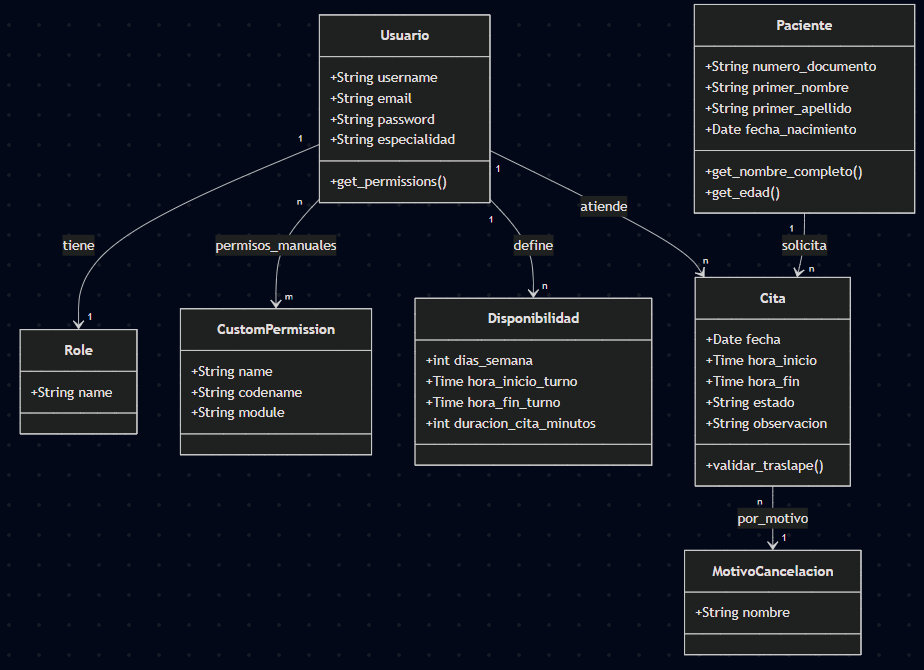
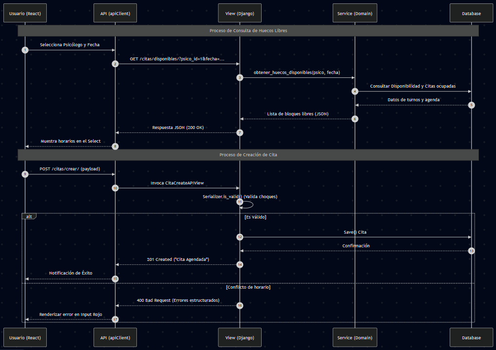

## 1. Descripción del proyecto

### Nombre del sistema
Vugo

### Problema que resuelve
En este momento, muchos profesionales de la salud mental gestionan sus citas de forma manual o mediante herramientas genéricas, lo que genera errores en la disponibilidad, falta de recordatorios y una gestión ineficiente de la información de los pacientes. Este sistema centraliza el proceso de agendamiento, permitiendo una organización óptima del tiempo del profesional y facilidad de acceso para el usuario.

### Usuarios del sistema
* **Administradores:** Tienen el control absoluto del sistema tanto de acciones dentro de los módulos como del resto de usuarios existentes, sin importar los permisos asignados.
* **Recepcionistas:** Tienen la capacidad de hacer un uso más general del sistema como la creación de citas, edición de usuarios, etc. Siempre y cuando cuenten con los respectivos permisos.
* **Psicólogos:** Gestionan su disponibilidad, revisan sus citas programadas y administran el perfil de sus pacientes.
* **Pacientes (Usuarios finales):** Pueden registrarse, visualizar horarios disponibles y agendar o cancelar citas de manera autónoma.

### Funcionalidades principales
* **Gestión de Autenticación:** Registro e inicio de sesión seguro para pacientes, psicólogos, recepcionistas y administradores (Django Auth).
* **Agendamiento en Tiempo Real:** Interfaz dinámica para seleccionar fechas y horas disponibles validando la existencia de los pacientes previamente creados.
* **Panel de Control (Dashboard):** Visualización de las próximas citas tanto para el psicólogo (únicamente las citas de cada uno) como para el resto de roles.
* **Interfaz Adaptable:** Diseño moderno y responsivo construido con Tailwind CSS para facilitar el uso desde móviles o computadores.

## 2. Análisis del sistema

### Actores
* **Administrador:** El "Dios" del sistema. Puede crear usuarios, asignar roles, gestionar permisos manuales y tiene visibilidad total sobre la agenda de todos los psicólogos y la base de datos de pacientes.
* **Psicólogo:** El actor principal operativo. Puede gestionar su propia disponibilidad (turnos), consultar su agenda diaria y puede ver/editar las observaciones clínicas únicamente de sus citas.
* **Recepcionista:** Es el encargado de la creación de pacientes y el agendamiento de citas para cualquier especialista, pero con restricciones para ver detalles clínicos confidenciales según el permiso.
* **Paciente:** Actor pasivo en el sistema (sus datos son gestionados por los otros actores).

### Casos de uso principales
* **Autenticación y autorización:** Login seguro y persistencia de sesión mediante JWT.
* **Gestión de disponibilidad:** Configuración de días, horas de inicio/fin y duración de sesiones por psicólogo.
* **Agendamiento inteligente:** Creación de citas validando que no existan traslapes y calculando huecos libres (considerando almuerzos y festivos en Colombia).
* **Gestión de pacientes:** Registro único por documento de identidad y búsqueda rápida.
* **Control de agenda:** Cambio de estados (Programada, Completada, Cancelada, No Asistió) y registro de motivos de cancelación (Soft Delete).

### Descripción de funcionalidades
* **Motor de disponibilidad:** Un algoritmo que cruza los turnos del psicólogo con las citas ya agendadas, excluyendo horas de almuerzo (12:00 - 13:00) y días festivos colombianos para mostrar solo horas reales de atención.
* **Seguridad por niveles:** Protección de datos sensibles. Por ejemplo, las observaciones de una cita pueden ser marcadas como "Confidenciales" para actores sin permisos clínicos.
* **Validación de conflictos:** El sistema impide proactivamente que un psicólogo tenga dos citas en el mismo rango horario.
* **Gestión de permisos dinámicos:** Capacidad de otorgar permisos específicos (como eliminar pacientes o gestionar roles) a cualquier usuario sin necesidad de cambiar su rol principal.

### Requerimientos

#### Funcionales
1. El sistema debe permitir el registro de pacientes con validación de documento único.
2. El sistema debe calcular automáticamente los horarios disponibles según la jornada laboral del psicólogo.
3. El sistema debe permitir la cancelación de citas solicitando un motivo predefinido.
4. El sistema debe restringir el acceso a módulos específicos según el rol y permisos del usuario.

#### No Funcionales
1. Seguridad: Uso de tokens JWT con rotación (Refresh Tokens) para proteger la comunicación.
2. Usabilidad: Interfaz reactiva (SPA) que permite agendar citas sin recargar la página.
3. Escalabilidad: Arquitectura desacoplada que permite que el backend (Django) y el frontend (React) crezcan de forma independiente.
4. Mantenibilidad: Código organizado bajo principios de Clean Code y separación de responsabilidades (Serializers, Services, Views).

### Arquitectura del sistema

El proyecto sigue un patrón de **Arquitectura de Referencia para Aplicaciones Modernas (Decoupled Architecture)**:

### Frontend (Cliente)
* **Tecnología:** Desarrollado en React.
* **Estructura:** Arquitectura modular basada en *Features* (Autenticación, Citas, Pacientes).
* **Estado y Peticiones:** Manejo del estado global mediante Context API y comunicación con el servidor mediante un fetch con interceptores.

### Backend (Servidor)
* **Tecnología:** Desarrollado en Django + Django REST Framework (DRF).
* **Capa de Modelos:** Persistencia de datos en PostgreSQL.
* **Capa de Servicios:** Contiene la lógica de negocio compleja (ej. algoritmo de cálculo de huecos libres para citas).
* **Capa de Serialización:** Validación y transformación de datos basado en ModelSerializers.
* **Capa de Vistas (API):** Endpoints expuestos mediante Class-Based Views (CBVs).

## 3. Diagramas UML

## 5. Estrategia de ramas (Branching)

### Definición de las tres ramas
* **main:** Es la rama principal. Solo se  pasa código estable y listo para producción. Acá no se realizan commits.
* **develop:** Esta la rama de integración. Aquí se consolidan todas las funcionalidades terminadas antes de pasar a main. Es el reflejo del estado actual del desarrollo.
* **feature/*:** Ramas temporales creadas para tareas específicas (ej: feature/login, feature/agendamiento). Se originan de develop y vuelven a ella cuando se finalice la tarea.

### Flujo de trabajo
Aunque esté como desarrollador único, sigo el estándar hoy en día:

* **Inicio de tarea:** Se crea una rama feature desde develop.
* **Desarrollo:** Se realizan los commits necesarios en la rama de la funcionalidad.
* **Integración:** Una vez finalizada y probada la tarea, se realiza un Merge hacia develop.
* **Lanzamiento (Release):** Cuando develop alcanza un estado estable con varias funcionalidades, se fusiona con main para marcar una versión oficial del sistema.

## 6. Documento de flujo de desarrollo

### ¿Cómo se desarrolla una nueva funcionalidad?
* **1. Capa Domain (models.py)**
Si la funcionalidad requiere nuevos datos entonces se define el modelo en Django dentro de la app correspondiente y posteriormente se ejecuta 'python manage.py makemigrations' y 'python manage.py migrate'.

* **2. Capa Application (services.py)**
NO se debe de poner lógica compleja dentro de la vista, para eso se edita el archivo de services.py, situado siempre bajo la misma arquitectura application/services.py y se escriben las funciones que únicamente realicen cálculos o validaciones (el. obtener_huecos_disponibles_de_psicologos)

* **3. Capa Infrastructure (serializer.py)**
El serializer.py es el que actúa como transformador de datos. En este archivo es donde se valida absolutamente todo, si algún dato es inválido, el serializer debe de lanzar el error para que el frontend lo reciba bien estructurado.

* **4. Capa Presentation (views.py, urls.py)**
Se crea la nueva view CBVs (Class-Based Views) por temas de reutilización de código (DRY) y soluciones rápidas preconfiguradas en Django para el CRUD (Create, Read, Update, Delete). Luego, se registra la ruta en urls.py. Probar SIEMPRE el endpoint con Postman antes de tocar React.

* **5. Frontend Services**
Crear la función en features/****/services/xxxApi.js y se usa el apiClient para heredar la gestión de tokens y errores.

* **6. Componente y vista final del usuario**
Crear el componente en React, después se implementa el manejo de estados y se le da uso a la lógica de "borde rojo". "Borde rojo" no es un término técnico directamente de Django, es una referencia visual común para los mensajes de error resaltados cuando falla la validación en el serializer, estos errores de validación se gestionan a través del atributo .error que devuelve un diccionario con campos fallidos, y así permite devolver errores en JSON para cada campo o errores generales.

### ¿Cómo se hace commit?
Los commit siempre se deben de redactar atómicamente la descripción detallada del cambio para evitar el famoso "ajustes variaditos". Por ende, se va a usar el estándar Conventional Commits:

Su estructura es: **tipo: descripción corta** (ej. fix: traslape de horarios en citas de 30 minutos.)

El flujo en la terminal es de dos pasos:

**git add .** (El "." es para subir todos los archivos modificados sin excepción. Si se quiere subir solamente el cambio de un archivo en específico, se cambia el "." por el nombre exacto del archivo)

**git commit -m "feat: implementar validación de horarios en el backend"** 

### ¿Cómo se hace merge?
Como cada funcionalidad viviría en su "propio mundo" o su propia rama temporal cuando se crea, primero se trae lo que otras personas hayan hecho en main a la rama en la que se está trabajando para resolver conflictos localmente:

**git checkout feature/gestion-permisos** (Para asegurarse de que sí se esté ubicado en esa rama)
**git pull origin main**

Posteriormente cuando se hayan resuelto los conflictos, se integra a la rama principal

**git checkout main** (Para ir directamente principal donde voy a integrar los cambios)
**git merge feature/gestion-permisos**
**git push origin main**